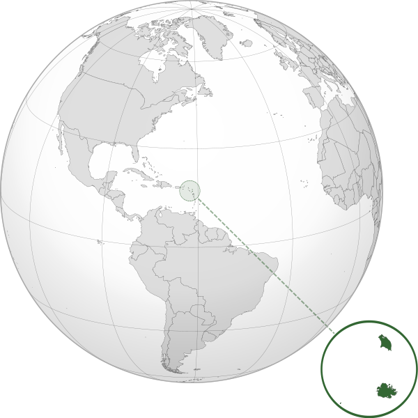

Where in the world is **Antigua and Barbuda**?
<!--question-->
Antigua and Barbuda is a sovereign island country in the West Indies in the Americas, lying between the Caribbean Sea and the Atlantic Ocean. It consists of two major islands, Antigua and Barbuda separated by 63km, and smaller islands.

