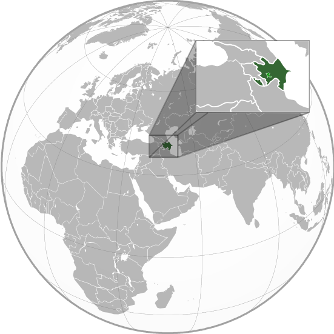

Where in the world is **Azerbaijan**?
<!--question-->
Azerbaijan, officially the **Republic of Azerbaijan**, is a country in the Caucasus region of Eurasia. Located at the crossroads of Eastern Europe and Western Asia; While often politically aligned with Europe, Azerbaijan is generally considered to be at least mostly in Southwest Asia geographically with its northern part bisected by the Boundaries between standard Asia-Europe divide, the Greater Caucasus. It is bounded by the Caspian Sea to the east, the Russian republic of Dagestan to the north, Georgia to the northwest, Armenia and Turkey to the west, and Iran to the south.

