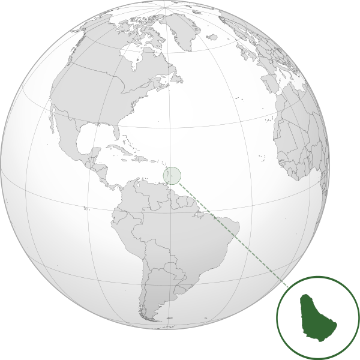

Where in the world is **Barbados**?
<!--question-->
Barbados is an island country in the Lesser Antilles of the West Indies, in the Caribbean region of North America. It is in the western area of the North Atlantic and 100km east of the Windward Islands and the Caribbean Sea. Barbados is the most easterly of the Caribbean Islands. Barbados is east of the Windwards, part of the Lesser Antilles.

