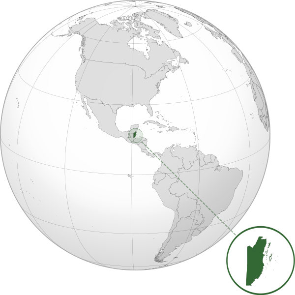

Where in the world is **Belize**?
<!--question-->
Belize, formerly known as British Honduras, is a Caribbean country located on the northeastern coast of Central America. Belize is bordered on the north by Mexico, on the east by the Caribbean Sea, and on the south and west by Guatemala.

