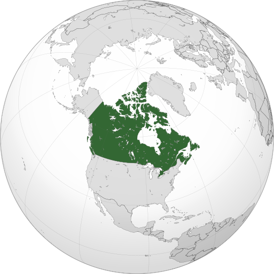

Where in the world is **Canada**?
<!--question-->
Canada is a country in the northern part of North America. Its ten provinces and three territories extend from the Atlantic to the Pacific and northward into the Arctic Ocean. Its southern and western border with the United States, is the world's longest bi-national land border.

