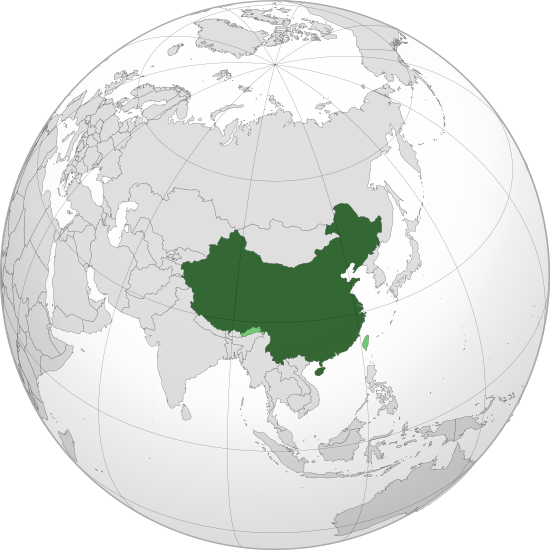

Where in the world is **China**?
<!--question-->
China, officially the **People's Republic of China** is a country in East Asia. Covering approximately 9.6 million square kilometers it is the world's third or fourth-largest country by area.

