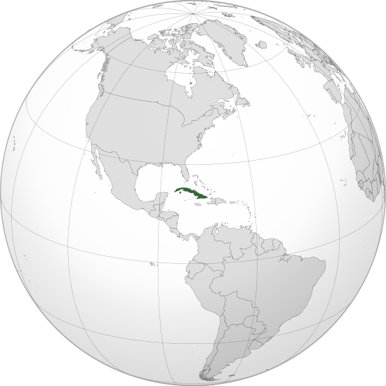

Where in the world is **Cuba**?
<!--question-->
Cuba, officially the **Republic of Cuba** is a country comprising the island of Cuba, as well as Isla de la Juventud and several minor archipelagos. Cuba is located in the northern Caribbean where the Caribbean Sea, Gulf of Mexico and Atlantic Ocean meet. It is east of the Yucatán Peninsula (Mexico), south of both the United States state of Florida and the Bahamas, west of Hispaniola, and north of both Jamaica and the Cayman Islands.

