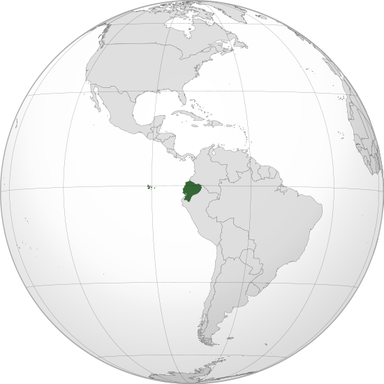

Where in the world is **Ecuador**?
<!--question-->
Ecuador officially the **Republic of Ecuador**, is a country in northwestern South America, bordered by Colombia on the north, Peru on the east and south, and the Pacific Ocean on the west. Ecuador also includes the Galápagos Islands in the Pacific.

