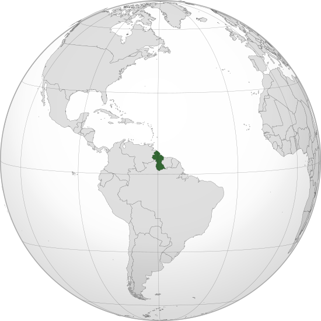

Where in the world is **Guyana**?
<!--question-->
Guyana, officially the **Co‑operative Republic of Guyana**, is a country on the northern mainland of South America. It is considered part of the Caribbean region because of its strong cultural, historical, and political ties with other Caribbean countries and the Caribbean Community. Guyana is bordered by the Atlantic Ocean to the north, Brazil to the south and southwest, Venezuela to the west, and Suriname to the east.

