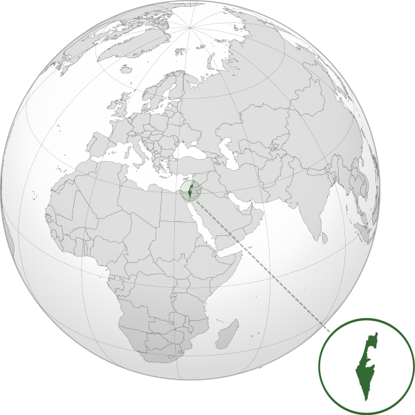

Where in the world is **Israel**?
<!--question-->
Israel, officially known as the **State of Israel**, is a country in Western Asia, located on the southeastern shore of the Mediterranean Sea and the northern shore of the Red Sea. It has land borders with Lebanon to the north, Syria to the northeast, Jordan on the east, the Palestinian territories of the West Bank and the Gaza Strip to the east and west, respectively, and Egypt to the southwest.

