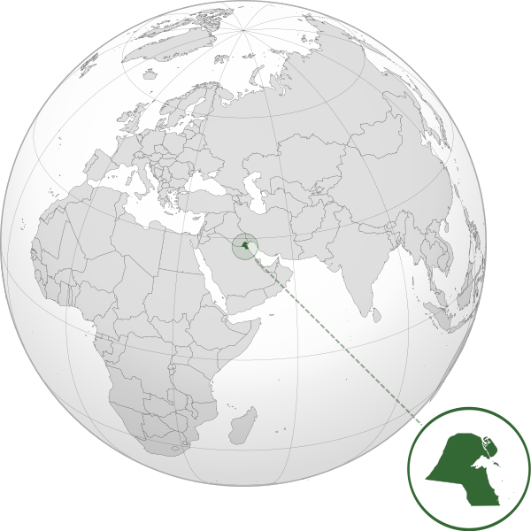

Where in the world is **Kuwait**?
<!--question-->
Kuwait, , officially the State of Kuwait, is a country in Western Asia. Situated in the northern edge of Eastern Arabia at the tip of the Persian Gulf, it borders Iraq to the north and Saudi Arabia to the south.

