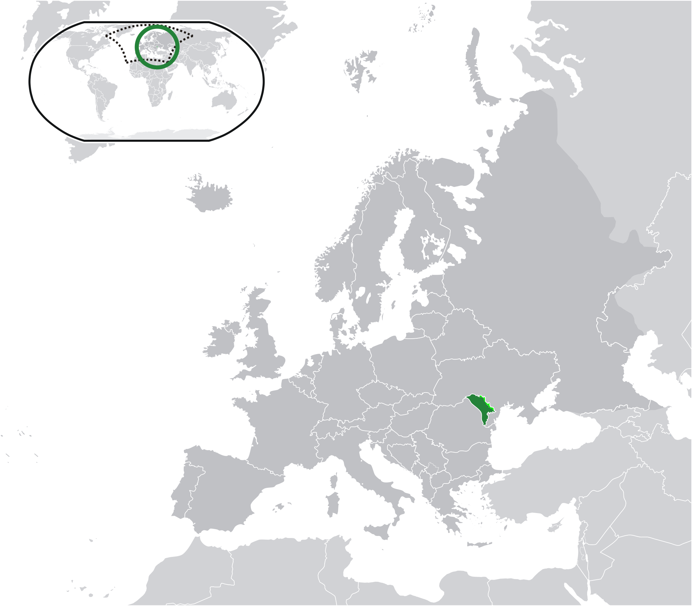

Where in the world is **Moldova**?
<!--question-->
Moldova, officially the **Republic of Moldova**, is a landlocked country in Eastern Europe. It is bordered by Romania to the west and Ukraine to the north, east, and south.

