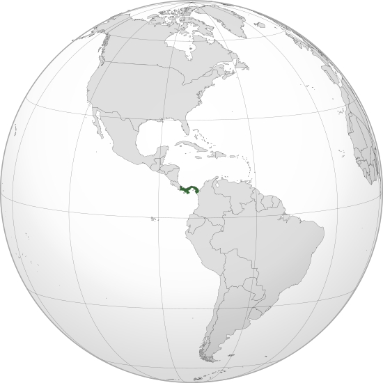

Where in the world is **Panama**?
<!--question-->
Panama, officially the **Republic of Panama**, is a transcontinental country in Central America and South America, bordered by Costa Rica to the west, Colombia to the southeast, the Caribbean Sea to the north, and the Pacific Ocean to the south.

