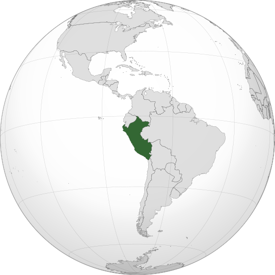

Where in the world is **Peru**?
<!--question-->
Peru, officially the Republic of Peru, is a country in western South America. It is bordered in the north by Ecuador and Colombia, in the east by Brazil, in the southeast by Bolivia, in the south by Chile, and in the south and west by the Pacific Ocean.

