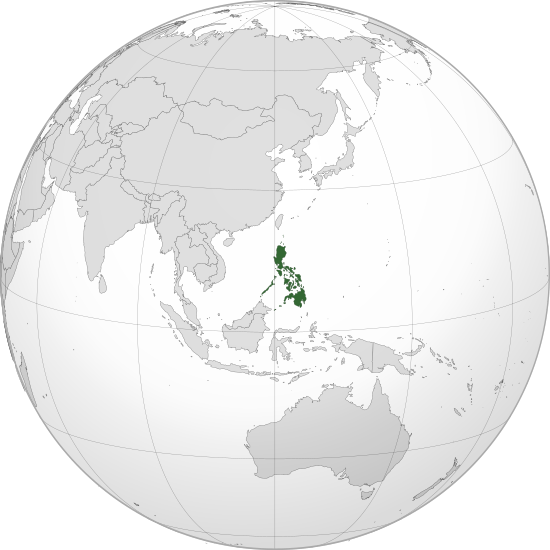

Where in the world is **Philippines**?
<!--question-->
The Philippines, officially the **Republic of the Philippines**, is an archipelagic country in Southeast Asia. Situated in the western Pacific Ocean, it consists of about 7,641 islands that are broadly categorized under three main geographical divisions from north to south: Luzon, Visayas, Mindanao. Bounded by the South China Sea to the west, the Philippine Sea to the east, and the Celebes Sea to the southwest, the Philippines shares maritime borders with Taiwan to the north, Japan to the northeast, Palau to the east, Indonesia to the south, Malaysia and Brunei to the southwest, Vietnam to the west, and China to the northwest.

