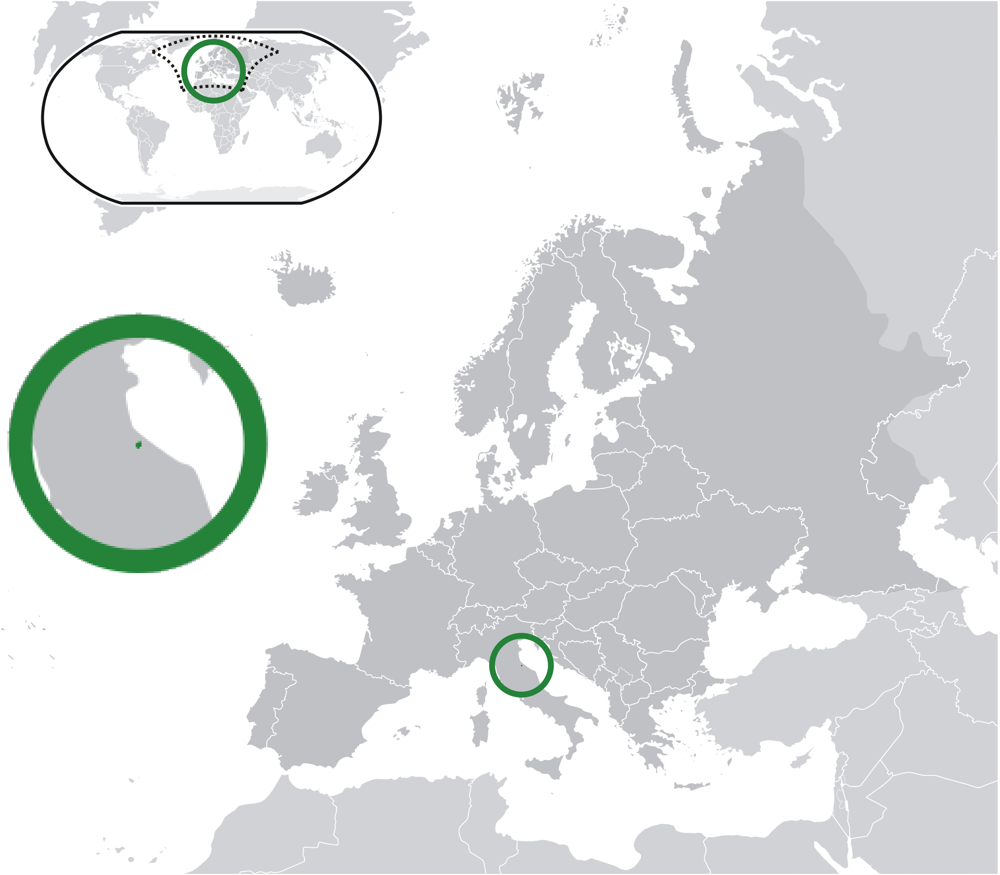

Where in the world is **San Marino**?
<!--question-->
San Marino, officially the **Republic of San Marino**, also known as the **Most Serene Republic of San Marino**, is a microstate in Southern Europe completely enclosed by Italy.

