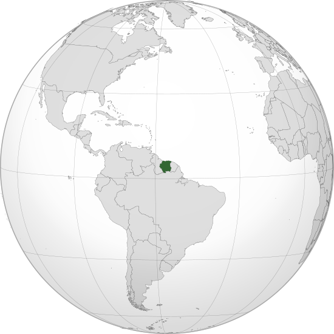

Where in the world is **Suriname**?
<!--question-->
**Suriname**,  officially known as the **Republic of Suriname**, is a country on the northeastern Atlantic coast of South America. It is bordered by the Atlantic Ocean to the north, French Guiana to the east, Guyana to the west and Brazil to the south.

