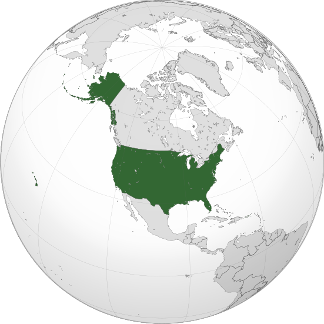

Where in the world is **United States**?
<!--question-->
The **United States of America** (**USA**), commonly known as the **United States** (**U.S.** or **US**), or **America**, is a country primarily located in North America, consisting of 50 states, a federal district, five major self-governing territories, and various possessions.

