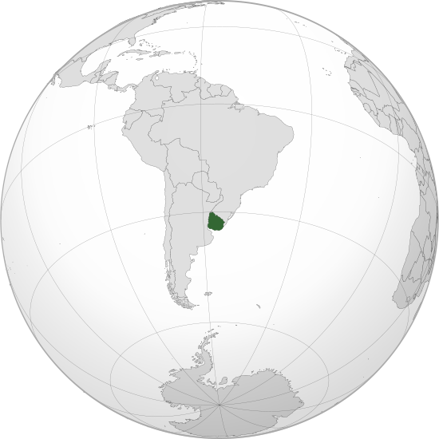

Where in the world is **Uruguay**?
<!--question-->
Uruguay, officially the **Oriental Republic of Uruguay**, is a country in the southeastern region of South America. It borders Argentina to its west and southwest and Brazil to its north and northeast, with the Río de la Plata (Silver River) to the south and the Atlantic Ocean to the southeast.

