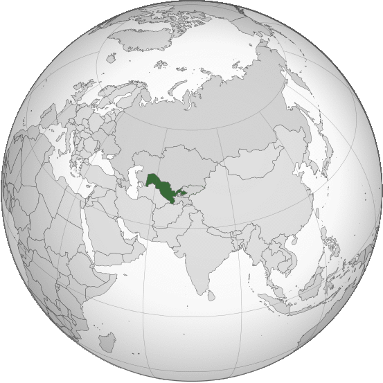

Where in the world is **Uzbekistan**?
<!--question-->
Uzbekistan, officially the **Republic of Uzbekistan**, is a country in Central Asia. It is surrounded by five landlocked countries: Kazakhstan to the north; Kyrgyzstan to the northeast; Tajikistan to the southeast; Afghanistan to the south and Turkmenistan to the south-west.

